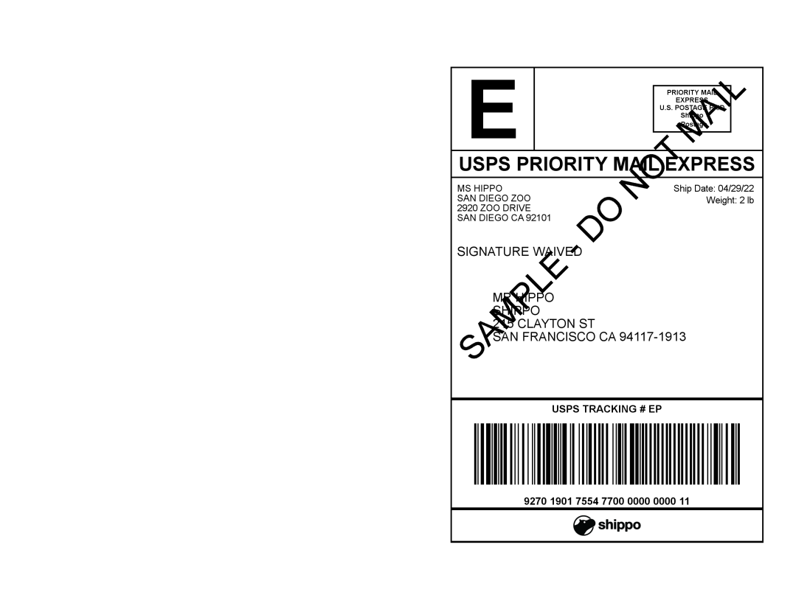
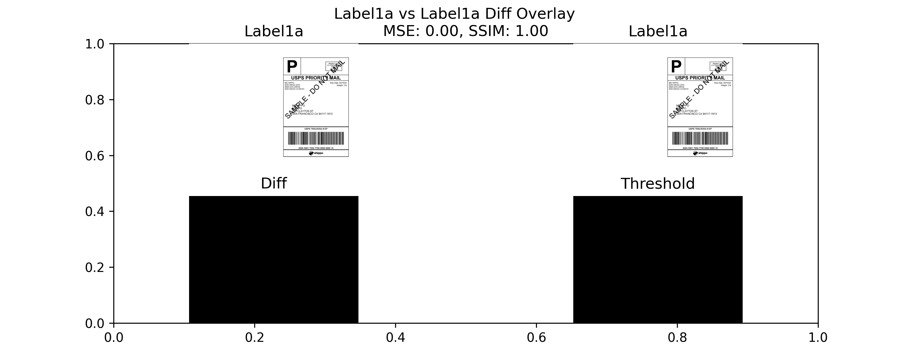
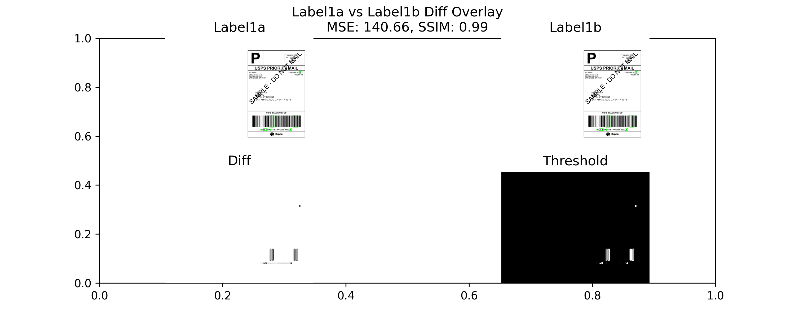
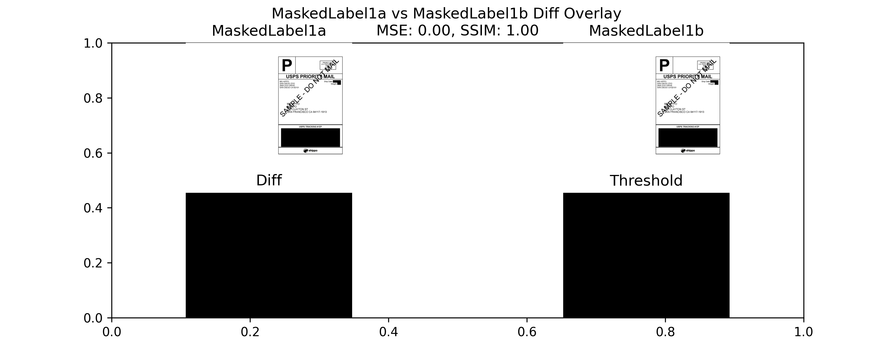
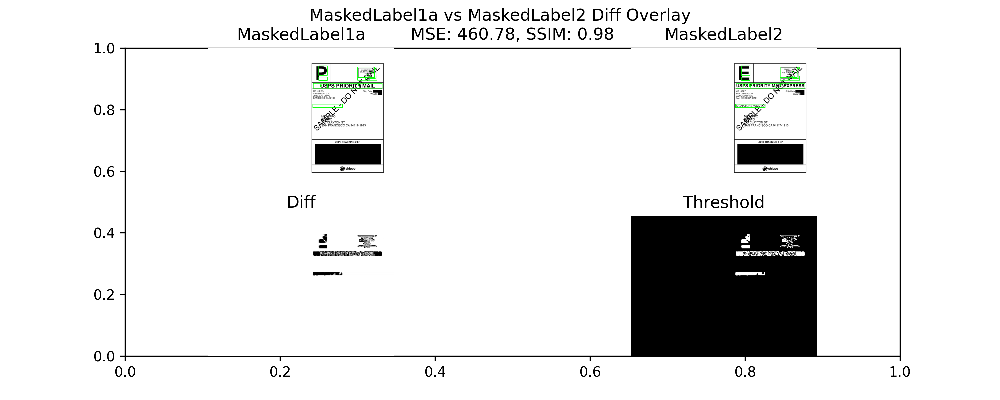

# Visual Label Testing Approach
The approach is based heavily on this [blog](https://pyimagesearch.com/2017/06/19/image-difference-with-opencv-and-python/).
Given two label images, compute two visual diff metrics: Mean Squared Error (MSE) and Structural Similarity Index (SSIM).  
Then output a visual comparison with boxes around the found differences.

The tests check various combinations: Comparing an image to itself, comparing two very similar labels, and two less similar labels.

As a long-term label checking approach, we have to address the fact that labels produced over time will have some variation, 
even with the same input from Shippo.  At a minimum, the timestamp and tracking number (and barcode) will be different.
So the verification is split into two parts: 
1. Mask the regions expected to change and compare - expect identical
2. Then for the regions that are expected to change, use more semantically targeted CV verification
   1. Verify that the barcode is readable and contains the expected tracking number
   2. Use OCR to verify the date
   3. etc.

## Examples
These are all produced by running the tests
### Given several similar labels

### Comparing a label to itself

### Comparing two very similar labels (only differ by timestamp and tracking #)

### Mask for variable regions

### Comparing two very similar labels, masked

### Comparing two less similar labels, masked

### Detecting barcode in reverse masked label

